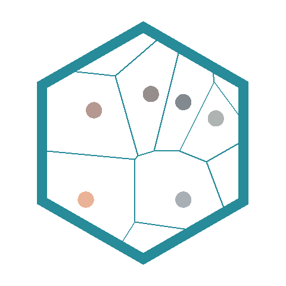
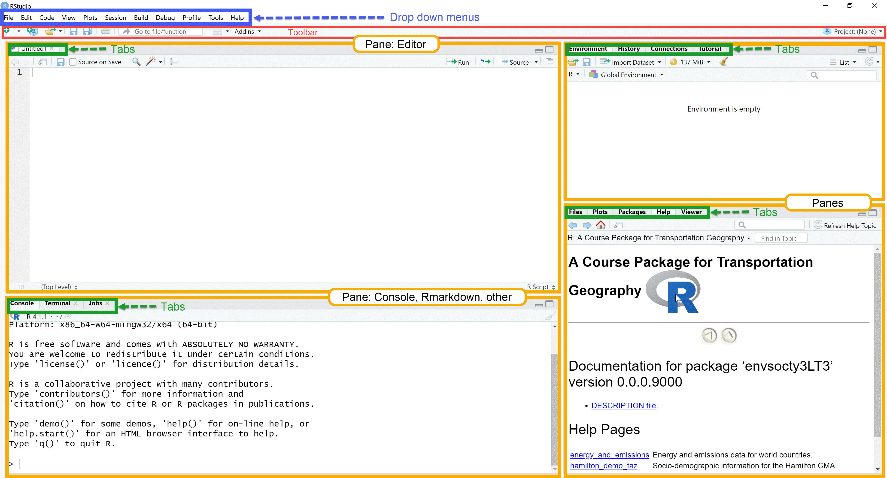
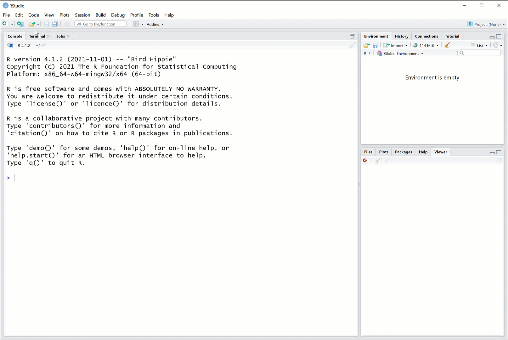
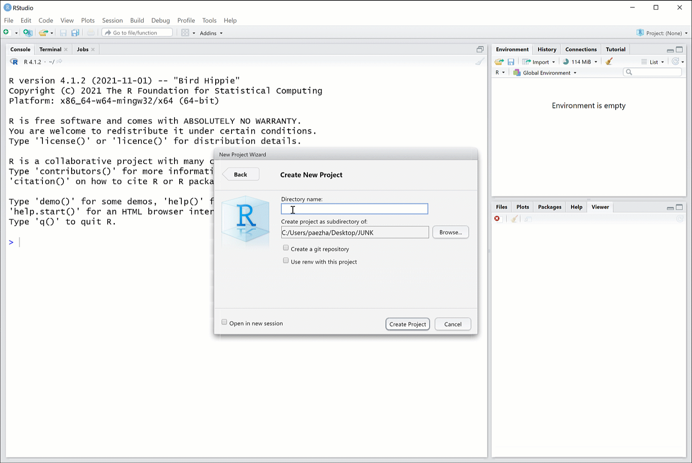
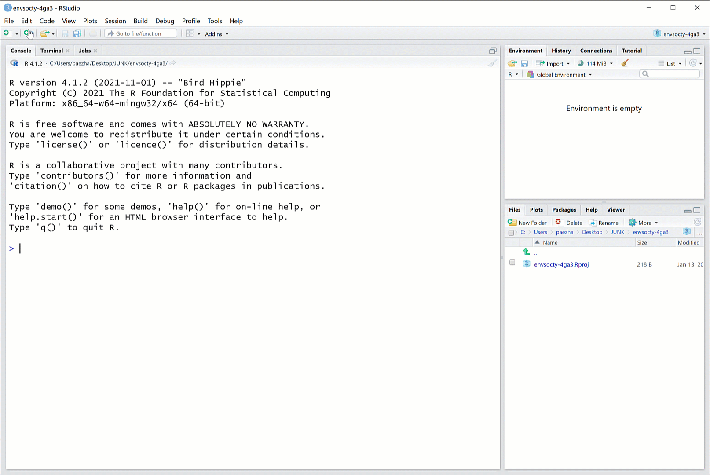
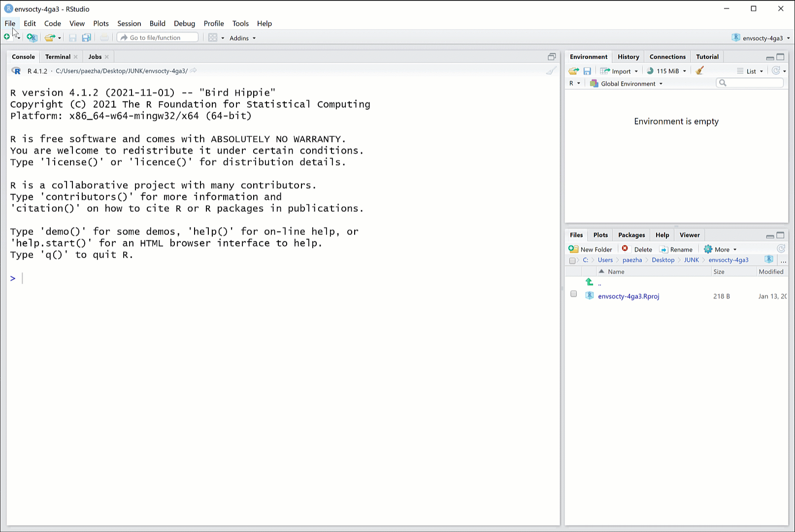
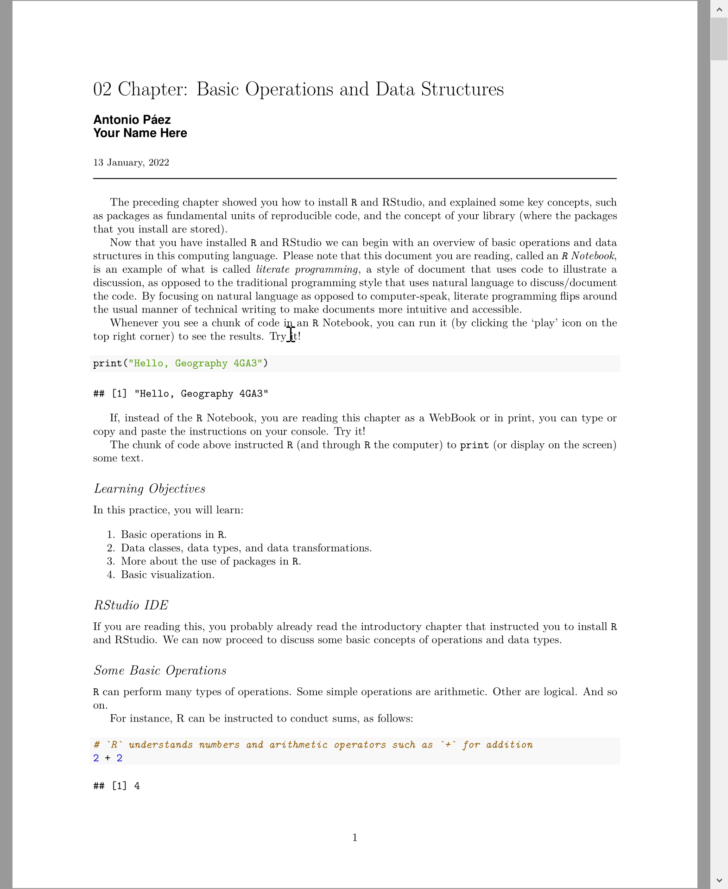
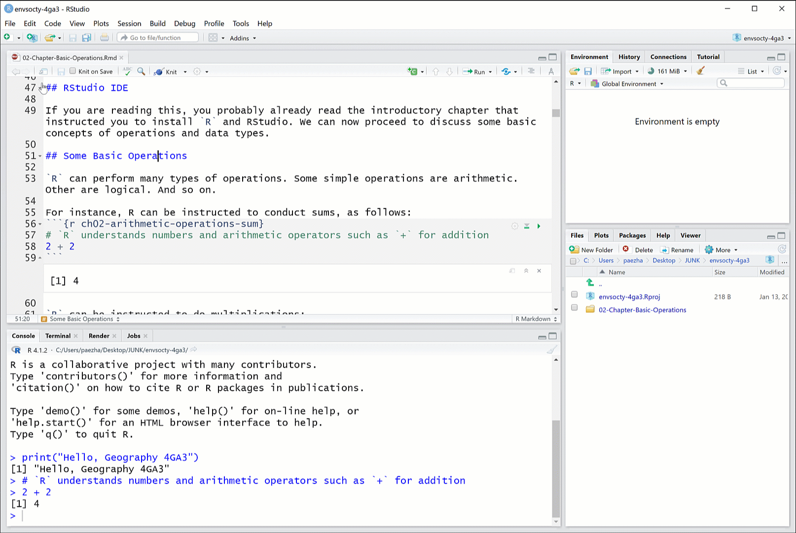
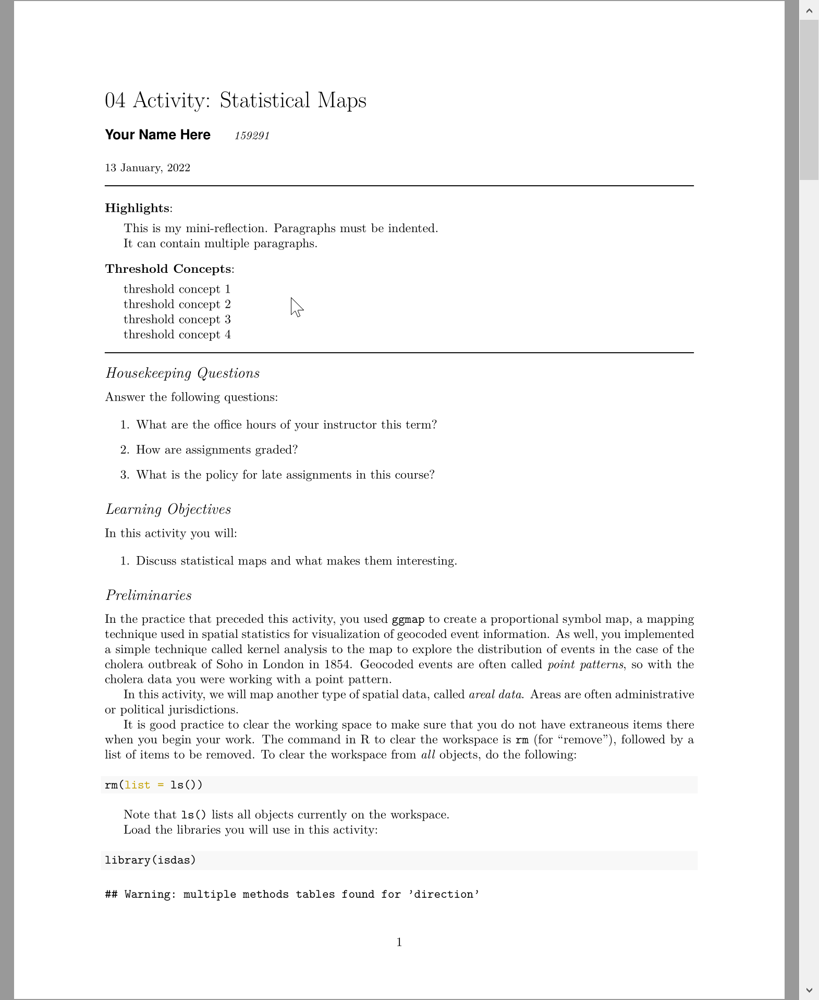

<!-- README.md is generated from README.Rmd. Please edit that file -->

# isdas

<!-- badges: start -->
<!-- Institutional logo: save in folder `images` -->


<!-- badges: end -->

Package {isdas} is a companion package to the book [An Introduction to
Spatial Data Analysis and Statistics: A Course in
R](https://paezha.github.io/spatial-analysis-r/). As an open educational
resource, it aims to combine various advantages of working with the [`R`
statistical computing project](https://www.r-project.org/):

-   Ease of distribution
-   Reproducibility
-   Availability of templates for computational notebooks
-   Rigor in documentation of data sets and computational products

The package includes the following components:

-   Document templates with *Chapters*.
-   Document templates with *Activities*.
-   Data sets used in the Chapters and Activities.
-   Custom functions.

The *Chapters* and *Activities* replicate the contents of the book, but
what sets them appart from a conventional book is that they are
interactive and editable, which means that you can work with them in
ways not possible with a conventional printed book.

The *Activities* are the documents that you can use to complete your
coursework. The templates are pre-formatted for you, so you do not have
to think about how to prepare the document, and can instead devote your
attention and energy to learn while creating great content.

## What do I need to use this package?

This course does not assume knowledge of, or experience working with
`R`. So, no previous knowledge is required, other than some experience
using computers in general, and maybe a word processor (e.g., Microsoft
Word) and spreadsheets (e.g., Microsoft Excel). To use the package you
will begin from the very basics: how to install and use the necessary
software: `R` and an Interactive Development Environment (e.g., RStudio)
as explained next.

### `R`: The open statistical computing project

What is `R`?

`R` is an open-source language for statistical computing. It was created
in the early 1990s by [Ross
Ihaka](https://en.wikipedia.org/wiki/Ross_Ihaka) and [Robert
Gentleman](https://en.wikipedia.org/wiki/Robert_Gentleman_(statistician))
at the University of Auckland, New Zealand, as a way to provide their
students with an accessible, no-cost statistical application for their
courses. `R` is now maintained by the `R` Development Core Team, and it
continues to be developed by hundreds of contributors around the globe.
`R` is an attractive alternative to other software packages for data
analysis (e.g., Microsoft Excel, Matlab, Stata, ArcGIS) due to its
open-source character (i.e., it is free), its flexibility, and large
user community. The size of the `R` community means that if there is
something you want to do (for instance, estimate a linear regression
model or plot geographical information), it is very likely that someone
has already developed a package for it in `R`.

A good way to think about `R` is as a core package, with a library of
optional packages that can be attached to increase its core
functionality. `R` can be downloaded for free at:

<https://cran.rstudio.com/>

`R` comes with a built-in console (a graphical user interface), but
better alternatives to the basic interface include Interactive
Development Environments like RStudio, which can also be downloaded for
free:

<https://www.rstudio.com/products/rstudio/download/>

`R` requires you to work using the command line, which is going to be
unfamiliar to many of you accustomed to user-friendly graphical
interfaces. Do not fear. People worked for a long time using the command
line, or using even more cumbersome systems, such as punched cards in
early computers. Graphical user interfaces are convenient, but they have
a major drawback, namely their inflexibility. A program that functions
based on graphical user interfaces allows you to do only what is
hard-coded in the user interface. Command line, as you will soon
discover, is somewhat more involved, but provides much more flexibility
in operation, and the ability to be more creative.

To begin, install `R` and RStudio in your computer. This
[video](https://www.youtube.com/watch?v=gZh91IdIMts) (5:23 min) shows
how to install these application.

If you are working in the GIS lab at McMaster you will find that these
have already been installed there. If you have used `R` and have a
previous instal, update it to `R` version 4.1.2 (2021-11-01) – “Bird
Hippie”. **This package was developed using “Bird Hippie”!**

### RStudio window: A Quick Tour

RStudio is an *Interactive Development Environment* (IDE for short). It
takes the form of a familiar window application, and it provides a
complete interface to interact with the language `R`. The application
consists of a window with toolbars and several panes. Some panes include
several tabs. There are the usual drop-down menus for common operations.
See Figure 1 below.


**Figure 1.** *RStudio IDE*

The editor pane allows you to open and work with text and other files.
In these files you can write instructions that can be passed on to `R`
for execution. Writing something in the editor does not execute the
instructions, it merely records them for possible future use.

The console pane is where instructions are passed on to the program.
When an instruction is typed (or copied and pasted) there, `R` will
understand that it needs to do something. The instructions must be
written in a way that `R` understands, otherwise errors will occur.

The top-right pane includes a tab for the environment; this is where all
data objects that are currently in memory are reported. The History tab
in the same pane acts like a log: it keeps track of all instructions
that have been executed in the console. Depending on your project, you
may see other tabs there.

The last pane in the bottom-right includes a few other useful tabs. The
File tab allows you to navigate directories in your computer, change the
working directory, see what files are where, and so on. The Plot tab is
where plots are rendered, when instructions require `R` to do so. The
Packages tab allows you to manage packages, which as mentioned above,
are pieces of code that can augment the functionality of `R`. The Help
tab is where you can consult the documentation for
functions/packages/see examples, and so on. The Viewer tab is for
displaying web content locally. Many `R` functions create html output
and it is in this pane where this kind of content can be previewed.

## Quick Start Guide

Once you have installed `R` and RStudio you are ready to install the
course package {isdas}. The package is available from
[GitHub](https://github.com/paezha/isdas), and to install it you need to
run the following code in your `R` console:

``` r
install.packages("remotes")
remotes::install_github("paezha/isdas")
```

This will download the package to your personal library of packages and
install it to make the package available for use locally. Behind the
scenes, {isdas} uses LaTeX to convert documents to PDF. For this you
need to have install LaTeX in your system. The simplest approach on any
platform is with `R` package [tinytex](https://yihui.name/tinytex/), as
follows:

``` r
install.packages(c('tinytex',
                   'rmarkdown'))
tinytex::install_tinytex()
```

After restarting R Studio, confirm that you have LaTeX with the
following command:

``` r
tinytex:::is_tinytex() 
```

## Recommended Workflow

After installing the course package, this is the recommended workflow
for using it in this course.

### Create a project for all your work in this course.

Follow the steps below to create a new project. A project is the best
way to keep your work in this course nicely organized.

You can create a new project using the buttons in the toolbar. Figure 2
shows one way of doing this:

**Figure 2.** *Create new project - option 1*

Figure 3 shows an alternative way of doing the same, using the button
for managing projects in the R Studio interface:

**Figure 3.** *Create new project - option 2*

You then need to select a new directory to store your new project. Give
the new directory a name, and save it in a place that you can easily
find (for instance, the folder where you keep your academic work).
Figure 4 illustrates the steps to do this:

**Figure 4.** *Choose to store the project in a new directory*

After you click ‘Create Project’, you will have an `R` session with your
new project. A project is a great way to keep all your files nicely
organized.

### Working with book chapters

You need to restart R Studio once after installing the package before
you can access the templates with the book chapters and activities.

After doing so, you will find that all the chapters in the book are
included in the package (instead of asking you to buy a book, we will
give you the contents). Chapter templates, though, can become much more
than just chapters in a printed book. Think of them as a living version
of the book, one that you can take ownership of and adapt to your
learning style and preferences. To begin working with the book chapters,
you will need to create a new file from a template. You can do this from
the button for new files in the toolbar or from the drop-down menu for
File, see below.

**Figure 6.** *Creating a new file from a template using the button in
the toolbar*

As an alternative, you can create a new file using the drop-down menu.
If you correctly installed the package, the templates should be listed
in the next box. To begin, select the template for
`02-Chapter-Basic-Operations` from the course package and give it a name
(the name could be anything, but it makes sense to name files
logically). After you click ‘OK’, a new R Markdown file will open in
your editor. Also, notice that a new folder appears in your project
where this file is located. Any other files that are placed there when
you create the chapter from a template are *required*, so do *not*
delete them.

This process is illustrated in Figure 7.

**Figure 7.** *Creating a new file from a template using the drop-down
menu*

Your new file is an R Markdown document. This is a text file with
*chunks* of code that can be executed. Chapter 2 will introduce you to
the use of `R` and the template is also a good introduction to R
Markdown. The document is editable, which means that you can annotate
it. To begin with, you can add your name to the list of authors of the
document. You can execute code by clicking on the ‘play’ icon on the
top-right corner of a chunk of code. The template also includes a
definition for a *textbox*. You can introduce a textbox in the text
using this format:

    :::{.textbox data-latex=""}
    This is my annotation.
    :::

Figure 7 shows some of these steps.

**Figure 7.** \_Working with your chapter file

Once you are happy with your work using this file, you can create a pdf
file to study/keep/share by *knitting* the document. Knitting will
convert the R Markdown to a pdf file. Click the Knit button in the top
left corner to do this. You can knit your document at any time, and as
many times as you want; remember, you can always start afresh by
creating a new R Markdown file with the same template. See Figure 8 for
an example of knitting.
 **Figure
8.** *Click ‘Knit’ on the toolbar to convert your R Markdown into a pdf
file*

Figure 9 shows the result of knitting your R Markdown file.
 **Figure
9.** *The result of knitting is a pdf file with your Chapter*

Since you can edit and annotate the text, you can essentially
*customize* the chapter so that it is a unique reflection of your
learning. As you progress with the course and complete all the chapters,
you will have a collection of *unique* chapters that track your very
personal learning experience using the book.

### Working with activities

Working on your activities (which you may need to submit for grading if
you are using this as part of a course) is very similar to working with
your readings. First, you need to create a new R Markdown file from a
template. For the first activity, you would select the template for
`04-Activity-Statistical-Maps`. Figure 10 illustrates the steps. Again,
you can give the file any name you want, but it makes sense to name them
logically. Once you click ‘OK’ a new R Markdown file will appear in your
editor, as well as a new folder where this file resides (see Figure 11).

**Figure 11.** *Creating a new file to work on an activity*

To begin, you can edit the header of the document with your personal
information, like name and student number (see Figure 11). You can also
run chunks of code. And importantly, to work on your exercise, you can
enter your answers as text and create new chunks of code to do any
calculations you need for your answers, as shown in Figure 12.

**Figure 12.** *Working on an activity*

After you complete your activity you can knit the document to generate
the pdf file for saving/submission/sharing. Click the Knit button in the
top left corner to knit (see Figure 13).
 **Figure
13.** *Knitting the activity*

This is the knitted activity:
 **Figure
13.** *Knitted activity*

If you are using this as part of a course, make sure to check the course
outline for instructions about how and when to submit.
